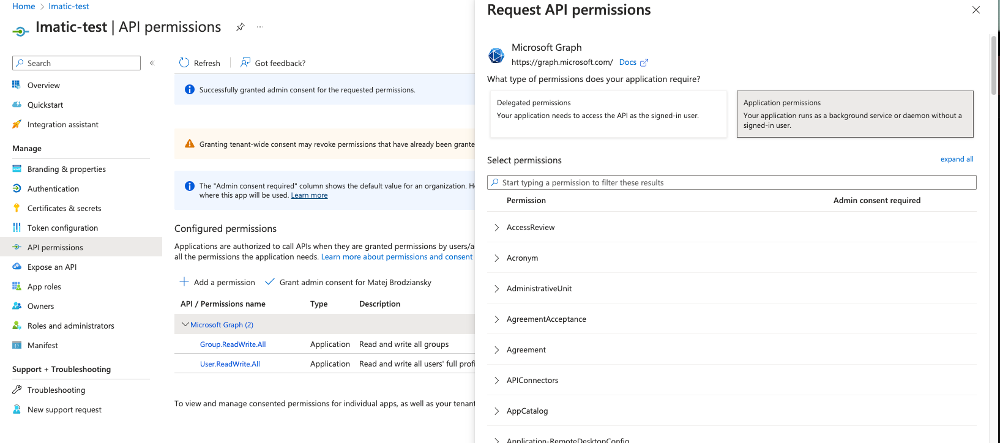
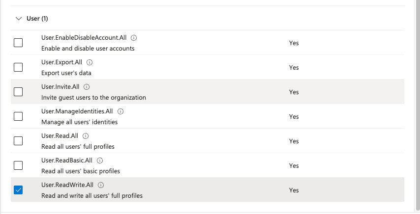
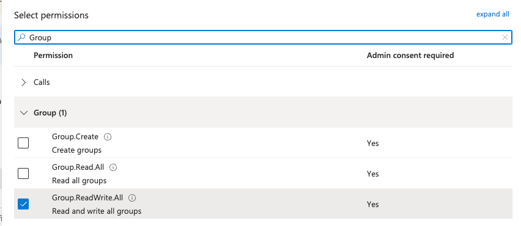
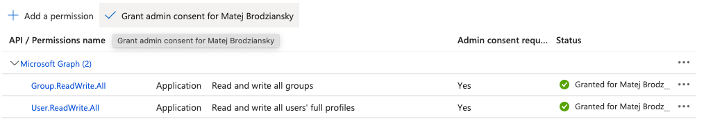
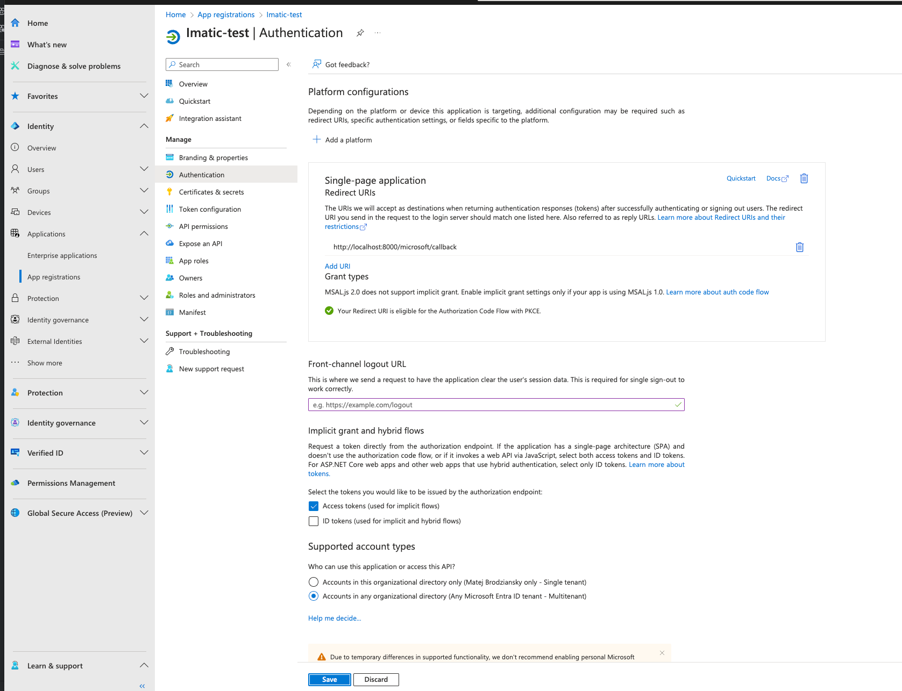

# Microsoft manager

## Install

```bash
# clone repo
cp .env.dist .env
# update .env file
```

```bash
make rebuild
make install
```

## Users
 configure the user in the .env
```.env
APP_LOGIN_USER=admin@example.com
APP_LOGIN_PASSWORD=password
```
- admin@example.com / password


# Microsoft Integration Commands

This README provides an overview of the available commands for managing Microsoft users and groups using the Docker console.

## Commands

### List Users
**Command:** `microsoft-list-users`
- **Usage:** `bin/docker-console microsoft:list-users`
- **Description:** Lists all users in the Microsoft directory.
```bash
bin/docker-console microsoft:list-users
```

### List Groups
**Command:** `microsoft-list-groups`
- **Usage:** `bin/docker-console microsoft:list-groups`
- **Description:** Lists all groups in the Microsoft directory.
```bash
make microsoft-list-groups
````

### List Group Members
**Command:** `microsoft-list-groups-members`
- **Usage:** `bin/docker-console microsoft:list-groups-members`
- **Description:** Lists all members of all groups in the Microsoft directory.
```bash
make microsoft-list-groups-members
```


### Add User to Group by IDs
**Command:** `microsoft-add-users-to-group-by-ids`
- **Usage:** `bin/docker-console microsoft:add-user-to-group-by-ids $(userId) $(groupId)`
- **Description:** Adds a user to a group using the user ID and group ID.
```bash
make microsoft-add-users-to-group-by-ids userId=88e5f4e2-3335-4551-8a56-15e4a4e357f1  groupId=95bc1ea6-1303-4a0a-9a03-ebf634c60470
```

### Remove User from Group by IDs
**Command:** `microsoft-remove-user-from-group-by-ids`
- **Usage:** `bin/docker-console microsoft:remove-user-from-group-by-ids $(userId) $(groupId)`
- **Description:** Removes a user from a group using the user ID and group ID.
```bash
make microsoft-remove-user-from-group-by-ids userId=88e5f4e2-3335-4551-8a56-15e4a4e357f1  groupId=95bc1ea6-1303-4a0a-9a03-ebf634c60470
````

### Add User to Group by Email and Group Name
**Command:** `microsoft-add-users-to-group`
- **Usage:** `bin/docker-console microsoft:add-user-to-group $(userEmail) $(groupName)`
- **Description:** Adds a user to a group using the user email and group name.
```bash
make microsoft-add-users-to-group userEmail=user@example.com  groupName=group-1
```


### Remove User from Group by Email and Group Name
**Command:** `microsoft-remove-user-from-group`
- **Usage:** `bin/docker-console microsoft:remove-user-from-group $(userEmail) $(groupName)`
- **Description:** Removes a user from a group using the user email and group name.
```bash
make microsoft-remove-user-from-group userEmail=user@example.com  groupName=group-1
```

### Clear All Groups
**Command:** `microsoft-clear-all-groups`
- **Usage:** `bin/docker-console microsoft:clear-all-groups`
- **Description:** Removes all users from all groups in the Microsoft directory.
```bash
make microsoft-clear-all-groups
```


### Clear Group by ID
**Command:** `microsoft-clear-group-by-id`
- **Usage:** `bin/docker-console microsoft:clear-group-by-id $(groupId)`
- **Description:** Removes all users from a specific group using the group ID.
```bash
make microsoft-clear-group-by-id groupId=95bc1ea6-1303-4a0a-9a03-ebf634c60470
```


# About microsoft

# 1.

- ### [Create new account](https://partner.microsoft.com/en-us/dashboard/account/v3/enrollment/introduction/partnership)

- ### [Video tutorial](https://www.youtube.com/watch?v=4gTW9_-qjjM&ab_channel=RavindraJadhav)

Now you can acces to  [Microsoft 365 admin center](https://admin.microsoft.com/Adminportal/Home#/homepage)

# 2.

Left panel -> Settings ->  [Integrated apps](https://admin.microsoft.com/Adminportal/Home#/Settings/IntegratedApps)


Discover, purchase, acquire, manage, and deploy Microsoft 365 Apps developed by Microsoft partners. You can also deploy and manage Line-of-business add-ins developed within your organization.
## Continue here
For advanced management of these apps go to the respective admin center or page :
[Azure Active Directory](https://entra.microsoft.com/matejbrodziansky.onmicrosoft.com/#view/Microsoft_AAD_IAM/TenantOverview.ReactView?Microsoft_AAD_IAM_legacyAADRedirect=true)

# 3.

[Centrum pro správu Microsoft Entra](https://entra.microsoft.com/#view/Microsoft_AAD_IAM/TenantOverview.ReactView?Microsoft_AAD_IAM_legacyAADRedirect=true)

Left panel -> Settings -> Integrated apps (Registered apps)

"+" Nová registrace

### FORM
#### Supported account types
- Accounts in any organizational directory (any Microsoft Enterprise ID tenant - multiple tenants)


#### Redirect URI (optional)
After successful user authentication, we will return the authentication response to this Redirect URI. At this point, it is optional but can be changed later, however, most authentication scenarios require some value.
- web
- <yourdomain.com>/microsoft-callback

IDs will be generated, they need to be placed in the .env file
```
Application (Client) ID:
Object ID:
Directory (Tenant) ID:
```

Insert into the .env file:
```
MICROSOFT_CLIENT_ID = Application (Client) ID
MICROSOFT_TENANT_ID = Directory (Tenant) ID
```

# 4.
On the left side of the application menu -> Certificates & secrets
Client secrets (1) -> New client secret -> Create

It returns

```
Description
Expires
Value
Secret ID
```

Insert into the .env file:

```
MICROSOFT_CLIENT_SECRET = Value
```

# 5. API permissions
In the application menu -> API permissions -> Add permissions -> Microsoft Graph -> Application  permissions -> User.Read + GROUP, Email




### Grant admin consent for USERNAME


# 6.

In the application menu -> Authentication -> Add a platform -> Web -> Redirect URIs
type in the address of the application, e.g. your-domain/microsoft/callback

Check:
- Access tokens (used for implicit flows)
- Accounts in any organizational directory (Any Microsoft Entra ID tenant - Multitenant)



# 7.  Define
- MICROSOFT_DEFAULT_GROUP_ID=your-group-id // ID of the group to which the user will be added after microsoft login
- MICROSOFT_REDIRECT_URL=your-domain/microsoft/callback


### Important Links
- [Microsoft package](https://packagist.org/packages/microsoft/microsoft-graph)
- [Group methods](https://learn.microsoft.com/en-us/graph/api/resources/group?view=graph-rest-1.0#methods)
- [User methods](https://learn.microsoft.com/en-us/graph/api/resources/user?view=graph-rest-1.0#methods)
- [User API  methods](https://learn.microsoft.com/en-us/graph/api/resources/user?view=graph-rest-1.0)
- [Add member to group ](https://learn.microsoft.com/en-us/graph/api/group-post-members?view=graph-rest-1.0&tabs=http)
### PHP CODES
- [User API  methods](https://learn.microsoft.com/en-us/graph/api/resources/user?view=graph-rest-1.0)
- [List a user's direct memberships](https://learn.microsoft.com/en-us/graph/api/user-list-memberof?view=graph-rest-1.0&tabs=php)
- [Add members](https://learn.microsoft.com/en-us/graph/api/group-post-members?view=graph-rest-1.0&tabs=php)
